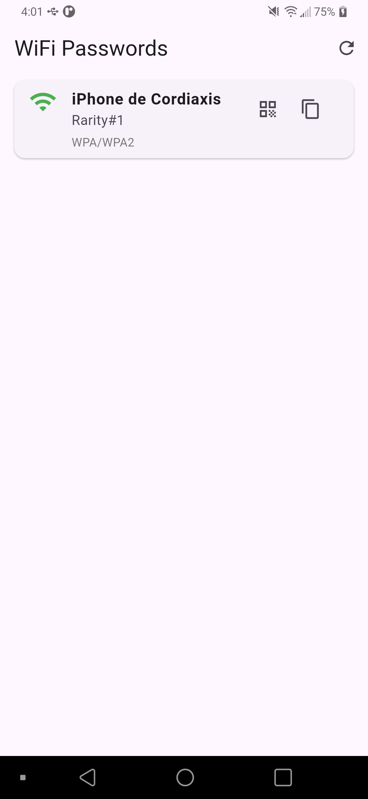

# 📶 WiFi Viewer

Una aplicación Flutter para Android que permite visualizar las contraseñas de las redes WiFi guardadas en tu dispositivo.

> ⚠️ **ATENCIÓN: Esta aplicación requiere acceso ROOT**

## Características

- **Lista todas las redes WiFi guardadas** con sus contraseñas
- **Muestra el tipo de seguridad** (WPA3, WPA2, WPA/WPA2, WEP, Open)
- **Detecta redes ocultas** (Hidden SSID)
- **Genera códigos QR** para compartir redes fácilmente
- **Copia contraseñas** al portapapeles con un toque
- **Interfaz moderna y limpia** con Material Design
- **Actualización en tiempo real** de las redes

## Requisitos

- ✅ Dispositivo Android con **acceso ROOT**
- ✅ Android 5.0 (Lollipop) o superior
- ✅ Permisos de superusuario (SU)

## Instalación

1. Descarga el APK desde [Releases](https://github.com/Cordiaxis/Wifi-Viewer/releases)
2. Instala la aplicación en tu dispositivo
3. Otorga permisos de ROOT cuando se solicite
4. ¡Listo! Abre la app y visualiza tus redes WiFi

## Compilar desde el código fuente

```bash
# Clonar el repositorio
git clone https://github.com/Cordiaxis/Wifi-Viewer.git
cd Wifi-Viewer

# Instalar dependencias
flutter pub get

# Compilar APK
flutter build apk --release

# O instalar directamente en dispositivo conectado
flutter run --release
```

## Uso

1. **Abrir la aplicación** - Al iniciar, se solicitarán permisos ROOT
2. **Ver redes** - La lista mostrará todas las redes WiFi guardadas
3. **Copiar contraseña** - Toca el icono 📋 para copiar al portapapeles
4. **Generar QR** - Toca el icono QR para generar un código QR compartible
5. **Actualizar** - Usa el botón de refrescar para recargar la lista

## Seguridad

Esta aplicación lee archivos del sistema que requieren privilegios ROOT:
- `/data/misc/apexdata/com.android.wifi/WifiConfigStore.xml`
- `/data/misc/wifi/WifiConfigStore.xml`
- `/data/misc/wifi/wpa_supplicant.conf`

**Nota:** La aplicación NO envía datos a internet. Todo el procesamiento es local.

## Tecnologías

- **Flutter** - Framework de desarrollo
- **Dart** - Lenguaje de programación
- **safe_device** - Detección de ROOT
- **qr_flutter** - Generación de códigos QR
- **xml** - Parsing de archivos de configuración

## Capturas de pantalla

<div align="center">
  
  
</div>


## Contribuir

Las contribuciones son bienvenidas! Si encuentras un bug o tienes una sugerencia:

1. Fork el proyecto
2. Crea una rama para tu feature (`git checkout -b feature/AmazingFeature`)
3. Commit tus cambios (`git commit -m 'Add some AmazingFeature'`)
4. Push a la rama (`git push origin feature/AmazingFeature`)
5. Abre un Pull Request

## Licencia

Este proyecto es de código abierto y está disponible bajo la licencia MIT.

## Disclaimer

Esta aplicación está diseñada únicamente para uso personal y educativo. El usuario es responsable del uso que le dé a esta herramienta. No nos hacemos responsables del mal uso de la aplicación.

Tampoco se planea subir a la Play Store, ya que requiere permisos ROOT.

---

**Desarrollado usando Flutter**  
**Aplicación hecha por Estudiante de Informática de Segundo Semestre de Universidad**
